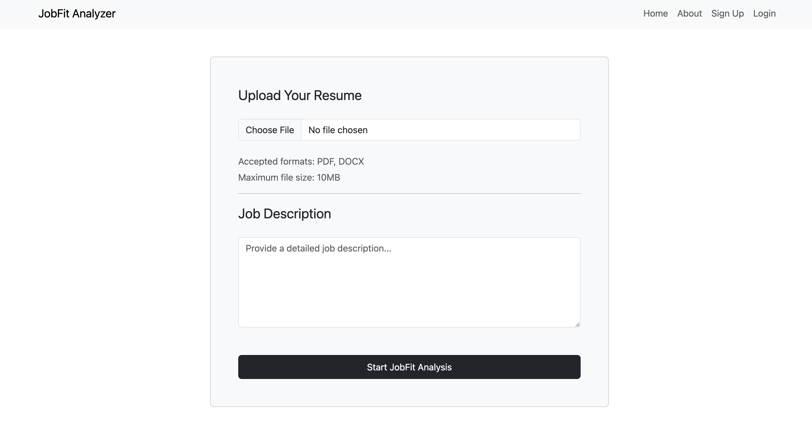

# JobFit-Analyzer


JobFit-Analyzer is a web application that helps job seekers analyze their resumes against job descriptions, providing a suggestion and a percentage match to show how well their resume aligns with the specific job they are interested in. The application is built using the MERN stack (MongoDB, Express.js, React.js, and Node.js) and utilizes JSON Web Tokens (JWT) for user authentication.

## Features

- Upload and analyze your resume against job descriptions.
- Receive a suggestion and percentage match indicating how well your resume fits the job requirements.
- User authentication using JWT, ensuring secure access to history logs.
- History log to keep track of past resume analyses (accessible only to logged-in users).

## Demo



You can find a live demo of the application [here](link_to_live_demo) (NOT AVAILABLE YET)

## Getting Started

Follow the steps below to set up and run the application locally on your machine.

### Prerequisites

- Node.js and npm (Node Package Manager) must be installed. You can download them from [here](https://nodejs.org/).

### Installation

1. Clone the repository:

   ```bash
   git clone https://github.com/UBakaliya/JobFit-Analyzer.git
   cd JobFit-Analyzer
   ```

2. Install server dependencies:

   ```bash
   cd server
   npm install
   ```

3. Install client dependencies:

   ```bash
   cd ../client
   npm install
   ```

### Configuration

1. Create a `.env` file in the `server` directory and add the following:

   ```env
   PORT=5000
   MONGODB_URI=your_mongodb_uri
   JWT_SECRET=your_jwt_secret
   ```

   Replace `your_mongodb_uri` with your MongoDB connection URI, and `your_jwt_secret` with your preferred JWT secret for authentication.

### Running the Application

1. Start the server:

   ```bash
   cd server
   npm start
   ```

2. Start the client (in a separate terminal):

   ```bash
   cd client
   npm start
   ```

The application will now be running locally. Open your browser and go to `http://localhost:3000` to access the JobFit-Analyzer application.

## Contributing

Contributions to JobFit-Analyzer are welcome! If you find any issues or want to add new features, feel free to open a pull request. Please ensure to follow the [contributing guidelines](CONTRIBUTING.md).

## License

This project is licensed under the [MIT License](LICENSE).

## Acknowledgements

- [Create React App](https://github.com/facebook/create-react-app) - Used as a foundation for the client-side application.
- [Express.js](https://expressjs.com/) - Backend web application framework for Node.js.
- [jsonwebtoken](https://www.npmjs.com/package/jsonwebtoken) - Library used for generating and verifying JWTs for user authentication.
- [MongoDB](https://www.mongodb.com/) - NoSQL database used to store user information and resume analysis data.

## Contact

If you have any questions or inquiries, please feel free to reach out to us at your_email@example.com.
